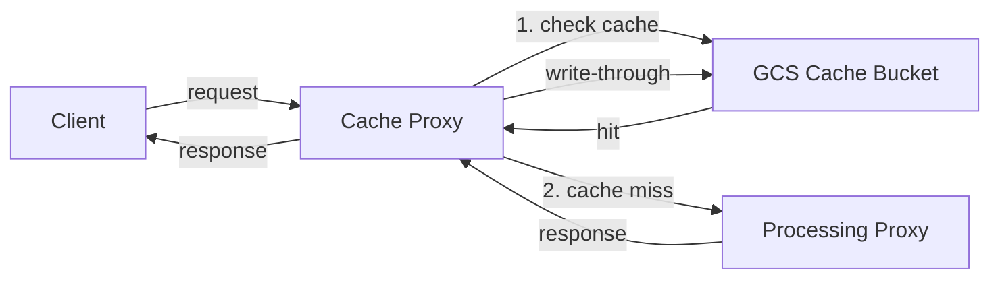

# asset-proxy

[](https://codecov.io/gh/SocialTip/asset-proxy)

An image and video processing service with an [imgproxy](https://docs.imgproxy.net/usage/processing)-compatible URL API. Uses ffmpeg (with optional NVIDIA GPU acceleration) for the vast majority of processing, and sharp for certain image-specific operations.

## URL format

```
/<signature>/<options>/plain/<source_url>[@<format>]
/<signature>/<options>/enc/<encrypted_source_url>[@<format>]
```

The signature segment is always required structurally. When `SIGNING_KEY` and `SIGNING_SALT` are not set, any value is accepted (e.g. `_`). When they are set, the signature is validated as described below.

**Examples:**

```
/_/resize:fill:480:360/plain/https://example.com/my-video.mp4
/_/resize:fill:480:360/fr:30/tr:10/plain/https://example.com/my-video.mp4@webm
/_/w:300/q:80/plain/https://example.com/photo.jpg@webp
/oKfUtW34Dvo.../resize:fill:480:360/enc/dGhpcyBpcyBhIGJhc2U2NC...
```

The service automatically detects whether to use image or video processing based on the output format suffix and source URL extension.

### Processing options

Options are path segments between the signature and the source URL. See the processing docs for the full list:

- **[Common options](docs/Processing.md)** — skip processing, raw passthrough, cache busting, expiry, limits, and more
- **[Image Processing](docs/Image.md)** — resize, crop, quality, filters, format-specific encoding options, and more
- **[Video Processing](docs/Video.md)** — resize, crop, framerate, cut, mute, thumbnail extraction, GPU acceleration, and more

### Source URLs

#### Plain HTTP(S) URLs

Use the `/plain/` prefix: `/plain/https://example.com/video.mp4`

#### Google Cloud Storage (`gs://`)

Use `gs://` URLs directly: `/plain/gs://my-bucket/path/to/video.mp4`

Authenticated via Application Default Credentials. A temporary signed URL is generated for ffmpeg.

#### Encrypted source URLs

Source URLs can be encrypted using AES-256-CBC, following the [imgproxy encrypted source URL format](https://docs.imgproxy.net/usage/encrypting_source_url):

1. Pad the source URL with PKCS#7 to 16-byte alignment
2. Generate a 16-byte IV
3. Encrypt with AES-256-CBC using the key and IV
4. Concatenate: `IV + ciphertext`
5. Encode with URL-safe Base64

Use the `/enc/` prefix instead of `/plain/` in the URL path. Requires `SOURCE_URL_ENCRYPTION_KEY` to be set.

### URL signing

URLs can be signed with HMAC-SHA256, following the [imgproxy URL signing format](https://docs.imgproxy.net/usage/signing_url). The signature is the first path segment and covers everything after it:

1. Take the path after the signature (e.g. `/resize:fill:480:360/plain/https://example.com/video.mp4`)
2. Compute HMAC-SHA256 of: `salt + path`
3. Encode the digest with URL-safe Base64

When `SIGNING_KEY` and `SIGNING_SALT` are not set, the signature segment is still required but any value is accepted.

## Caching

The same Docker image supports two operating modes, controlled by the `FORWARD_URL` environment variable.

### Processing mode (default)

When `FORWARD_URL` is **not** set, the proxy runs in its standard processing mode — it fetches the source asset, processes it (resize, transcode, etc.), and returns the result. No caching is performed in this mode.

### Cache proxy mode

When `FORWARD_URL` is set (e.g. `FORWARD_URL=http://asset-proxy:8080`), the proxy runs as a lightweight cache layer in front of a processing instance. `CACHE_BUCKET` must also be set in this mode.

On each request the cache proxy:

1. Checks the GCS cache bucket for the request path
2. On a **cache hit**, streams the cached object directly to the client with `ETag` and `Last-Modified` response headers derived from the cached object metadata
3. On a **cache miss**, forwards the request verbatim (path + headers) to `FORWARD_URL`, then streams the response back to the client while simultaneously writing it to the cache bucket



In a typical deployment, both containers run in the same service. The cache proxy is the public-facing container, and the processing proxy is only reachable internally.

## Info endpoint

The `/info/` endpoint returns JSON metadata about a source asset without processing it. See [Metadata](docs/Metadata.md) for full documentation.

## URL generator package

The `@socialtip/asset-proxy-url-generator` npm package generates asset-proxy-compatible URL paths programmatically. It uses the same types as the server's URL parser.

```bash
npm install @socialtip/asset-proxy-url-generator
```

```ts
import { generateUrl } from "@socialtip/asset-proxy-url-generator";

const url = generateUrl({
  sourceUrl: "https://example.com/photo.jpg",
  outputFormat: "webp",
  resize: { type: "fill", width: 480, height: 360 },
  quality: 80,
});
// => /_/rs:fill:480:360/q:80/plain/https://example.com/photo.jpg@webp
```

Encrypted source URLs and signed URLs are supported via the optional second argument:

```ts
const url = generateUrl(
  { sourceUrl: "https://example.com/photo.jpg", outputFormat: "webp" },
  {
    encryptionKey: "0123456789abcdef...", // hex-encoded 32-byte key
    signingKey: "...", // hex-encoded HMAC key
    signingSalt: "...", // hex-encoded salt
  },
);
```

## Project structure

This repository is a pnpm monorepo with three packages:

| Package                                | Path                     | Published | Description                                                                        |
| -------------------------------------- | ------------------------ | --------- | ---------------------------------------------------------------------------------- |
| `@socialtip/asset-proxy-url-parser`    | `packages/url-parser`    | Yes       | Shared URL schema, parsing, signature verification/generation, and encryption      |
| `@socialtip/asset-proxy-url-generator` | `packages/url-generator` | Yes       | Generates asset-proxy-compatible URL paths with encryption and signing             |
| `proxy`                                | `packages/proxy`         | No        | The image/video processing service (Fastify + ffmpeg + sharp), deployed via Docker |

## Development

Requires [asdf](https://asdf-vm.com/) with the `nodejs` plugin.

```bash
asdf install        # installs Node version from .tool-versions
corepack enable     # enables pnpm
pnpm install
pnpm dev            # starts the proxy with hot reload on :8080
```

## Docker

```bash
docker build -t asset-proxy -f packages/proxy/Dockerfile .
```

### CPU only

```bash
docker run -e SKIP_GPU=1 -p 8080:8080 asset-proxy
```

### With GPU (NVIDIA)

```bash
docker run --gpus all -p 8080:8080 asset-proxy
```

Requires the [NVIDIA Container Toolkit](https://docs.nvidia.com/datacenter/cloud-native/container-toolkit/install-guide.html).

## Deployment

CI/CD runs automatically on pushes to `main` and on pull requests. After tests pass, the CD job builds a Docker image and pushes it to GitHub Container Registry (`ghcr.io/socialtip/asset-proxy`). The `@socialtip/asset-proxy-url-parser` and `@socialtip/asset-proxy-url-generator` packages are published to GitHub Packages on release.

Images are tagged with the commit SHA. Pushes to `main` are additionally tagged `latest`.

## Testing

See [docs/Testing.md](docs/Testing.md) for full testing documentation, including integration tests and deployment test plans.

## Environment variables

See [docs/Configuration.md](docs/Configuration.md) for the full list of environment variables.

## HTTP/2

The proxy serves over cleartext HTTP/2 (h2c). This is required for deploying on Cloud Run with end-to-end HTTP/2 enabled, which avoids two limitations of HTTP/1.1 on Cloud Run:

- **Response size limit** — Cloud Run buffers HTTP/1.1 responses and rejects any that exceed 32 MB. HTTP/2 responses are streamed through without a size limit, so large video and image responses are delivered without issue.
- **CDN cache hits** — Cloud Run's built-in load balancer CDN only caches responses that include a `Content-Length` header. HTTP/1.1 streamed responses use `Transfer-Encoding: chunked` which omits `Content-Length` and therefore bypasses the CDN cache. HTTP/2 does not use chunked encoding, so the proxy always sets `Content-Length` and responses are cacheable at the CDN layer.

The health check endpoint also speaks h2c. When testing locally with curl, use `--http2-prior-knowledge`:

```bash
curl --http2-prior-knowledge http://localhost:8080/health
```

## Health check

```
GET /health → 200 ok
```

The health endpoint is available over h2c on the main port. If your load balancer or orchestrator requires HTTP/1.1 health probes, set the `HEALTH_PORT` environment variable to start an additional plain HTTP/1.1 server that serves the same `/health` endpoint:

```bash
HEALTH_PORT=8082 pnpm start
curl http://localhost:8082/health   # HTTP/1.1
```
